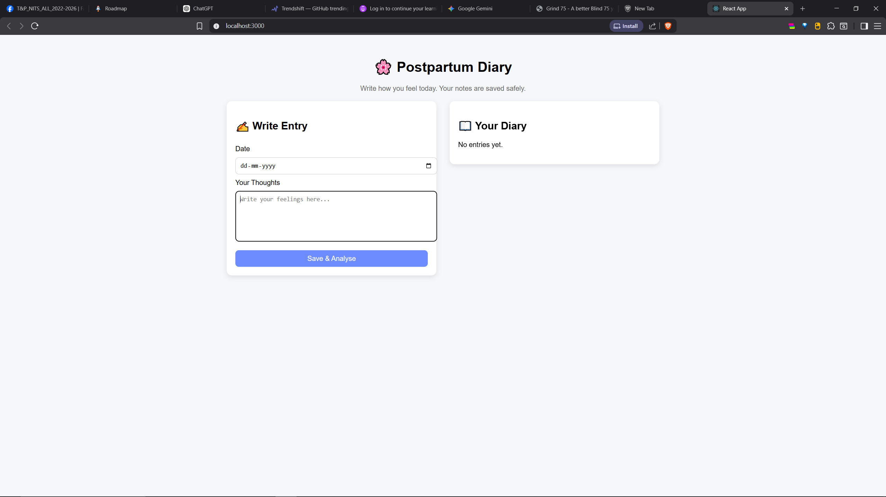

# 🌸 PPD Diary: Postpartum Support & Analysis

<p align="center">
  
</p>

[](https://fastapi.tiangolo.com/)
[](https://reactjs.org/)
[](https://scikit-learn.org/)

**PPD Diary** is a compassionate digital companion designed to support mothers during the postpartum period. By combining simple journaling with advanced Machine Learning analysis, it helps track mental well-being and identifies early signs of postpartum depression (PPD).

---

## ⚡ Quick Start (Windows)

If you are on Windows, you can launch the entire ecosystem with a single command:

1. **Install Dependencies**: Run `pip install -r backend/requirements.txt` and `npm install` in `frontend`.
2. **Run the App**: Double-click [**run.bat**](file:///run.bat) in the root directory.

*This script launches the FastAPI backend and the React frontend in separate, dedicated windows.*

---

## 🧠 Deep Dive: ML Backend

The core of PPD Diary is its robust machine learning pipeline, designed to provide accurate emotional assessments.

### 1. Hybrid Feature Extraction
Instead of relying solely on text, our **`CombinedExtractor`** builds a high-dimensional feature space from:
- **TF-IDF Vectorization**: Analyzes word patterns using 1-3 ngrams (up to 5000 features).
- **Hand-Crafted NLP Features**: Tracks keyword density for positive/negative sentiments, word counts, and first-person perspective ratios.
- **EPDS Integration**: Factors in an estimated score based on the *Edinburgh Postnatal Depression Scale* logic.

### 2. The Stacking Classifier
To ensure maximum reliability, we use a **Stacking Classifier** that aggregates predictions from four diverse base models:
- **Random Forest & Gradient Boosting**: For capturing complex, non-linear emotional patterns.
- **SVM (Linear Kernel)**: For high-dimensional text separation.
- **Logistic Regression**: Used as the final meta-estimator to blend the base model outputs into a final severity classification.

### 3. Safety First: Crisis Detection
Beyond standard analysis, the backend implements a **Crisis Detection Layer**. It scans for high-risk phrases (self-harm, harm to infant, etc.) and immediately flags entries as **"Severe"** with a crisis alert, bypassing standard inference for immediate safety priority.

---

## ✨ Key Features

- **✍️ Mindful Journaling**: A safe space to record thoughts, feelings, and daily experiences.
- **📊 Severity Classification**: Five-level detection: *Minimal, Mild, Moderate, High, and Severe*.
- **📈 EPDS Estimation**: Real-time scoring based on statistical linguistic analysis.
- **📖 Emotional Timeline**: Track your progress over time with persisted entry history.

---

## 📂 Project Structure

```text
PPD/
├── backend/
│   ├── app/                # FastAPI Application logic
│   │   ├── api/            # API Endpoints (Entries, Analysis)
│   │   ├── nlp/            # Hybrid Extractor & Stacking Predictor
│   │   └── models/         # File-based Persistence
│   ├── data/               # Datasets and trained .pkl artifacts
│   └── train_model.py      # ML Training Pipeline
├── frontend/
│   ├── src/                # React UI Components
│   └── public/             # Static assets
└── run.bat                 # One-click Windows startup
```

---

## 🛡️ Disclaimer
*This tool is intended for informational and supportive purposes only. It is not a substitute for professional medical advice, diagnosis, or treatment. Always seek the advice of your physician or other qualified health provider with any questions you may have regarding a medical condition.*

---
<p align="center">Made with ❤️ for mothers everywhere.</p>